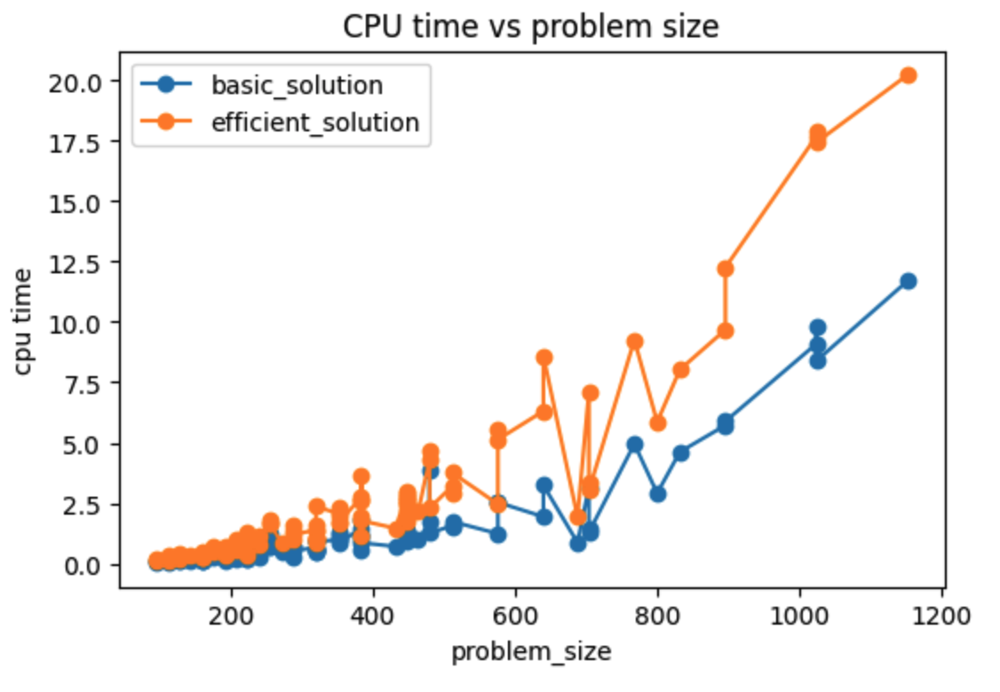
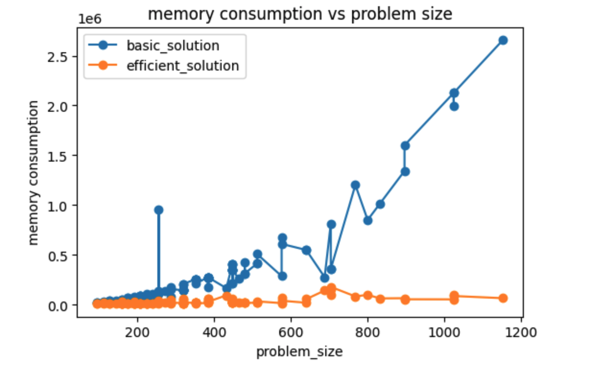

## Introduction

This repo explores how to reduce the memory consumption in a DNA alignment process if we use Dynamic Programming Algorithm.  If we use dynamic programming, the time complexity is O(mn), but space complexity is O(mn) which is unacceptable because DNA can be a very very long sequence. It will require a huge memory size. 

However, if we combine dynamic programming with divide-and-conquer we can reduce the space complexity to O(n) without changing the time-complexity(but 2 times cpu time than pure dynamic programming).  This will save a factor of  memory but only incur a factor of 2 cpu time, which is a good tradeoff.

## Result Comparison

#### dynamic programming

#### dynamic programming with divide and conquer

## read the details

read the details at [dna-alignment.ipynb](./dna-alignment.ipynb)
