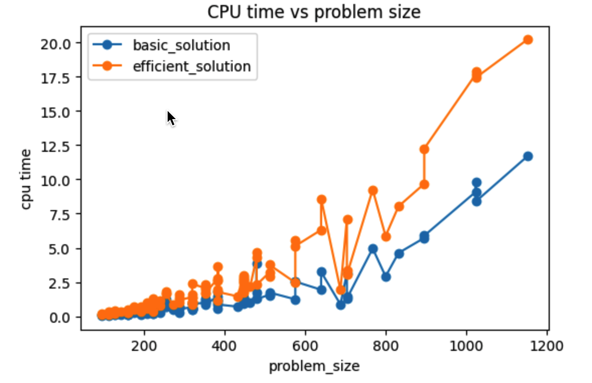
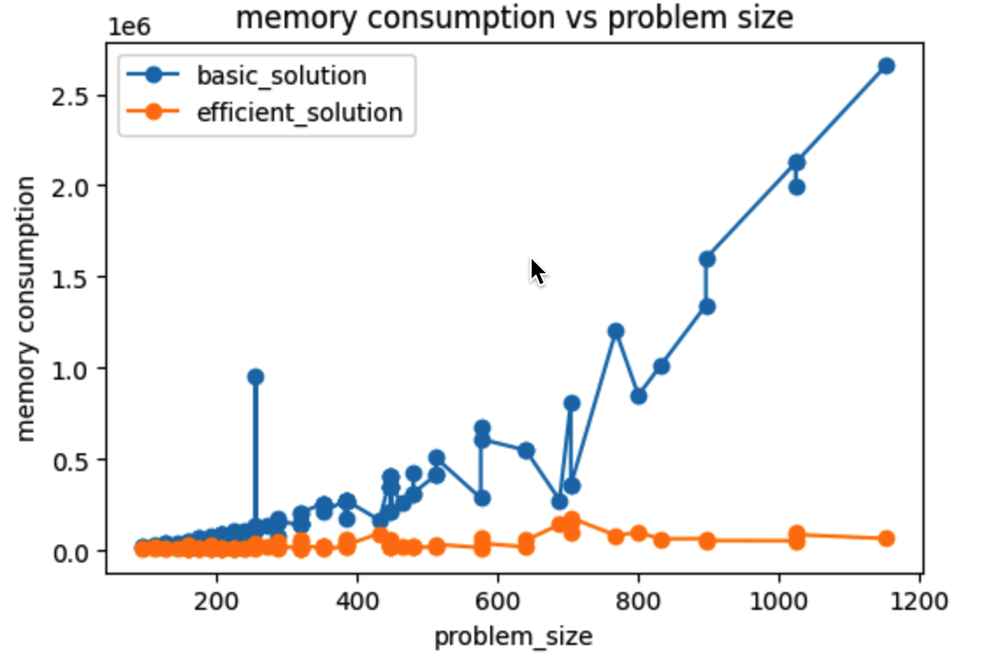

# DNA-alignment

Suppose we are given two strings $X$ and $Y$, where $X$ consists of the sequence of symbols $x_1, x_2 . . . x_m$ and $Y$ consists of the sequence of symbols $y_1$ , $y_2$ . . . $y_n$ . Consider the sets $\{1, 2, . . . , m\}$ and $\{1, 2, . . . , n\}$ as representing the different positions in the strings $X$ and $Y$, and consider a matching of these sets:

> a matching is a set of ordered pairs with the property that each item occurs in at most one pair. We say that a matching $M$ of these two sets is an alignment if there are no “crossing” pairs: if $(i, j), (i’, j’) \in M$ and $i < i’$ , then $j < j’$ . Intuitively, an alignment gives a way of lining up the two strings, by telling us which pairs of positions will be lined up with one another.

Our definition of similarity will be based on finding the optimal alignment between $X$ and $Y$, according to the following criteria. Suppose $M$ is a given alignment between $X$ and $Y$:

1. First, there is a parameter $\delta_e$ > 0 that defines a gap penalty. For each position of $X$ or $Y$ that is not matched in $M$ — it is a gap — we incur a cost of $\delta$. 
2. Second, for each pair of letters $p$, $q$ in our alphabet, there is a mismatch cost of $\alpha_{pq}$ for lining up $p$ with $q$. Thus, for each $(i, j)\in M$, we pay the appropriate mismatch cost $α_{x_iy_j}$ for lining up $x_i$ with $y_j$ . One generally assumes that $\alpha_{pp}$ = 0 for each letter $p$—there is no mismatch cost to line up a letter with another copy of itself.
3. The cost of $M$ is the sum of its gap and mismatch costs, and we seek an alignment of minimum cost.

We will implement the DNA-alignment using two approaches:

1. Basic version: Dynamic programming, time complexity $O(mn)$, space complexity $O(mn)$

2. Efficient version: Dynamic programming combined with Divide-and-Conquer, time complexity $O(mn)$ (but 2 times cpu time than pure dynamic programming), space complexity $O(n)$(if we choose to split $X$ in divide-and-conquer). DNA is usually a very very long string, ie $m$ and $n$ are very large. Therefore, this efficient version will save a factor of $m/2$ memory but only incur a factor of 2 cpu time, which is a good tradeoff. 

3. The results are as follows:

   

